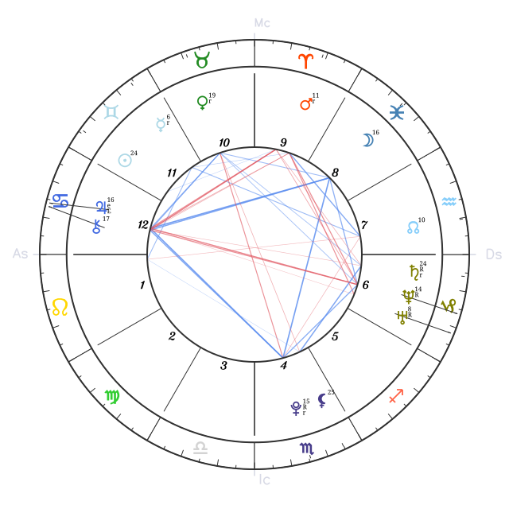
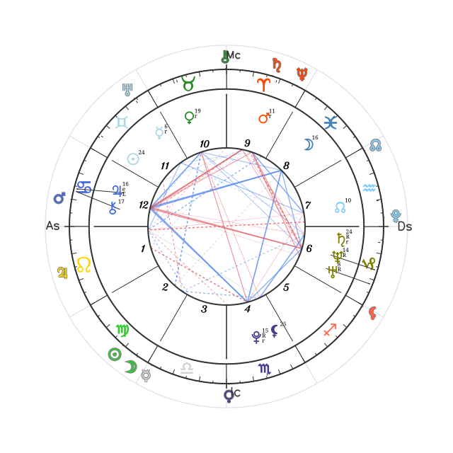

# react-natal-chart

A React component for rendering natal astrology charts — and transit
bi-wheels — as SVG, built on top of
[`circular-natal-horoscope-js`](https://www.npmjs.com/package/circular-natal-horoscope-js).

<p align="center">
  
</p>

## Install

```sh
npm install @menelaos/react-natal-chart circular-natal-horoscope-js
```

`react` (>=18) and `circular-natal-horoscope-js` are peer dependencies.

## Usage

```tsx
import { AstrologyChart, getHoroscope } from '@menelaos/react-natal-chart';

const horoscope = getHoroscope(new Date('1990-06-15T08:30:00'), {
  latitude: 40.7128,
  longitude: -74.006,
});

function App() {
  return <AstrologyChart horoscope={horoscope} width={640} height={640} />;
}
```

`getHoroscope` wraps `circular-natal-horoscope-js` with the settings
`AstrologyChart` expects (whole-sign houses, tropical zodiac, major + minor
aspects). You can also build the `Horoscope` yourself and pass it straight
through — the component only reads from it, it never needs your birth data
directly.

### Customizing the cast (`getHoroscope` options)

Pass a third `options` argument to override any of the defaults above —
anything you leave out keeps its default:

```tsx
const horoscope = getHoroscope(birthDate, birthPlace, {
  houseSystem: 'placidus',
  zodiac: 'sidereal',
});
```

`options` accepts:

| Field              | Type                     | Default               | Notes                                                                                                        |
| ------------------ | ------------------------ | --------------------- | ------------------------------------------------------------------------------------------------------------ |
| `houseSystem`      | `HouseSystem`            | `'whole-sign'`        | `'equal-house'`, `'koch'`, `'campanus'`, `'placidus'`, `'regiomontanus'`, `'topocentric'`, or `'whole-sign'` |
| `zodiac`           | `ZodiacSystem`           | `'tropical'`          | `'tropical'` or `'sidereal'`                                                                                 |
| `aspectTypes`      | `AspectType[]`           | `['major', 'minor']`  | `'major'` and/or `'minor'`                                                                                   |
| `customOrbs`       | `Record<string, number>` | major/minor orb table | Orb, in degrees, per aspect key (e.g. `conjunction`, `square`)                                               |
| `language`         | `string`                 | `'en'`                | ISO 639-1 code for house/sign/aspect labels                                                                  |
| `aspectPoints`     | `string[]`               | library default       | Which bodies/points can originate an aspect                                                                  |
| `aspectWithPoints` | `string[]`               | library default       | Which bodies/points they can aspect to                                                                       |

`HouseSystem`, `ZodiacSystem`, `AspectType`, and `HoroscopeOptions` are all
exported types, so overrides are checked at compile time.

### What's plotted

`AstrologyChart` draws everything `circular-natal-horoscope-js` computes — the
full `Planet` union:

| Type   | Points                                                                                      |
| ------ | ------------------------------------------------------------------------------------------- |
| Bodies | Sun, Moon, Mercury, Venus, Mars, Jupiter, Saturn, Uranus, Neptune, Pluto, Chiron, Sirius    |
| Points | North Node, South Node, Lilith (mean Black Moon)                                            |
| Angles | Ascendant, Midheaven — drawn as the chart axis rather than a glyph, so not part of `Planet` |

South Node is drawn as the North Node glyph rotated 180° — the traditional
convention, since the two nodes are always in exact opposition. Sirius has no
traditional single glyph of its own; it's drawn as a small 6-ray asterisk, the
convention most chart-drawing software falls back to for fixed stars.

### Transit bi-wheel

Pass a `transit` prop to draw a ring of the moving planets around the natal
wheel, with dashed chords to the natal points they contact:

<p align="center">
  
</p>

```tsx
import {
  AstrologyChart,
  getHoroscope,
  getTransitContacts,
  rankTransitContacts,
} from '@menelaos/react-natal-chart';

const natal = getHoroscope(birthDate, birthPlace);
const transitNow = getHoroscope(new Date(), place);
const transitNext = getHoroscope(new Date(Date.now() + 86_400_000), place); // for applying/separating
const contacts = rankTransitContacts(getTransitContacts(natal, transitNow, transitNext));

function App() {
  return (
    <AstrologyChart
      horoscope={natal}
      transit={{ horoscope: transitNow, contacts }}
      width={640}
      height={640}
    />
  );
}
```

## What else is exported

Beyond the chart itself, the library exposes the pieces it's built from —
useful if you want the underlying data without the SVG, or to build your own
visualization:

- **Chart summaries** — `buildChartSummary` / `buildTransitSummary` flatten a
  `Horoscope` into a small, JSON-serializable shape (placements, angles,
  aspects) suitable for sending to an API or an LLM.
- **Ephemeris helpers** — `getCelestialBody`, `longitudeOf`, `cuspLongitude`,
  `isRetrograde`, `longitudeOfMidheavenAscendant`.
- **Geometry helpers** — `getPointPosition`, `normalizeAngle`,
  `angularDistance`, `getSign`, `assembleLocatedPoints` (the collision-based
  glyph fan-out).
- **Domain data** — `getDignities` (essential dignities), `getTransitContacts`
  / `rankTransitContacts`, `Planet`, `ZodiacSign`, `SIGN_COLOR`, `SIGN_EMOJI`.

See [`src/index.ts`](src/index.ts) for the full public surface.

## Development

```sh
npm install
npm run build       # dist/ (ESM + CJS + .d.ts) via tsup
npm run typecheck
npm run lint
npm test
npm run example      # regenerates docs/example-*.svg from the built output
```

## License

MIT — see [LICENSE](./LICENSE).
